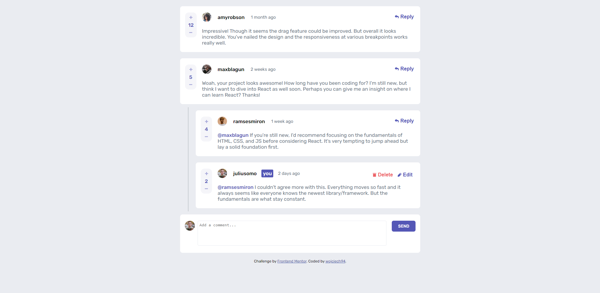

# Interactive-Comments-Section

This is a solution to the [Interactive comments section challenge on Frontend Mentor](https://www.frontendmentor.io/challenges/interactive-comments-section-iG1RugEG9).

## Table of contents

- [Overview](#overview)
  - [Features](#Features)
  - [Screenshot](#screenshot)
  - [Links](#links)
- [Author](#author)
- [My process](#my-process)
  - [Built with](#built-with)
  - [What I learned](#what-i-learned)

## Overview

### Features

Users should be able to:

- View the optimal layout for the app depending on their device's screen size
- See hover states for all interactive elements on the page
- Create, Read, Update, and Delete comments and replies
- Upvote and downvote comments
- See dynamic textareas size (depending on required area)
- Keep application state by saving data in `localStorage` (Save current state after refreshing)
- See dynamic `created at` time after reloading data

### Screenshot

### Links

- Solution URL: [Solution](https://github.com/wojciech94/Interactive-Comments-Section/)
- Live Site URL: [Site](https://wojciech94.github.io/Interactive-Comments-Section/)

## Author

- Website - [Wojciech94](https://github.com/wojciech94)
- Frontend Mentor - [@wojciech94](https://www.frontendmentor.io/profile/wojciech94)

## My process

### Built with

- Semantic HTML5 markup
- CSS custom properties
- Flexbox
- BEM architecture
- Mobile-first workflow
- Vanilla Javascript
- JSON data fetch
- Local Storage

### What I learned

- Improved json data fetching
- Improved using classes
- How to extract json object into class instance object
- How to use Date timestamp to track comments creation time
- How to save objects data to local storage
